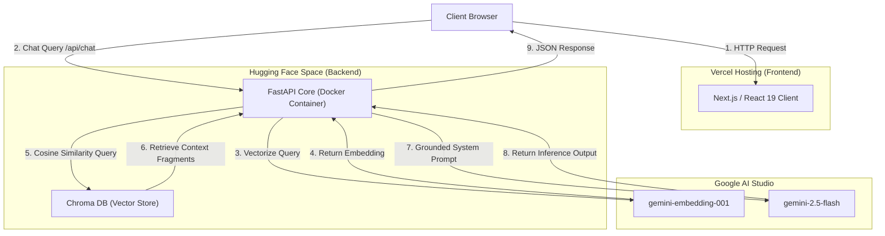

# Shahrukh Faisal - Interactive Portfolio Workspace

A high-fidelity developer portfolio designed to mimic the exact Visual Studio Code desktop interface. It features smooth layout resizing, a mobile responsive slide-out drawer, and an integrated RAG (Retrieval-Augmented Generation) terminal chatbot that queries my experience and projects in real time.

This workspace is a monorepo consisting of a Next.js frontend (deployed on Vercel) and an asynchronous FastAPI backend (deployed as a Docker space on Hugging Face).

---

## Technical Architecture

The following diagram illustrates the flow of queries from the client browser through the RAG pipeline to the vector database and Google's Gemini models.



---

## Video Demonstration

The video below demonstrates the real-time layout resizing, file exploration, and the RAG terminal assistant in action:

<video src="demo.mp4" width="100%" controls muted></video>

---

## Interactive Feature Breakdown

<details>
<summary><b>Frontend Workspace Features</b></summary>

* **Fidelity VS Code UI**: Implements a complete folder explorer, active document tabs, status bar metrics, and a cyberpunk network topology viewer.
* **Layout Reflow Engine**: Custom `ResizeObserver` listeners and `requestAnimationFrame` throttles update sidebar width and terminal height states synchronously without dragging lag.
* **Mobile Drawer Overlay**: Automatically collapses panels on viewport widths `< 768px` and translates the sidebar into a sliding drawer overlay with a tap-to-dismiss dimmer backdrop.
* **Console Terminal**: Custom terminal component with a blinking cursor caret, scrollback buffer optimization, and standard console commands like `clear` and `help`.
</details>

<details>
<summary><b>Backend AI & Systems Features</b></summary>

* **Retrieval-Augmented Generation**: Indexes project portfolios, certificates, and academic documents into a structured vector database.
* **Local Embeddings & Storage**: Uses **Chroma DB** to run similarity matching queries to extract the most relevant data blocks.
* **Grounded Guardrails**: Implements strict system boundaries. If a user asks general, off-topic questions, the backend catches the query and outputs a customized console error string rather than hallucinating answers.
* **Asynchronous FastAPI Core**: Written using asynchronous Python handlers to handle concurrent client requests efficiently.
* **Dockerized Space**: Fully containerized to run in any Linux environment, exposing port `7860` for Hugging Face Spaces.
</details>

---

## Local Setup

### Backend Local Launch

1. **Prepare Python Environment**:
   Navigate to the backend folder and create a virtual environment:
   ```bash
   cd backend
   python -m venv .venv
   .venv\Scripts\activate   # On Windows
   source .venv/bin/activate # On Unix
   ```

2. **Install Dependencies**:
   ```bash
   pip install -r requirements.txt
   ```

3. **Configure Environment**:
   Create a `.env` file at the root of the workspace and define your Gemini API key:
   ```env
   GEMINI_API_KEY=your_gemini_api_key_here
   ```

4. **Ingest Documents**:
   Initialize and populate the local Chroma vector database:
   ```bash
   python rag/ingest.py
   ```

5. **Start Dev Server**:
   ```bash
   uvicorn main:app --host 127.0.0.1 --port 8000 --reload
   ```

### Frontend Local Launch

1. **Install Packages**:
   Navigate to the frontend folder and install the required npm dependencies:
   ```bash
   cd frontend
   npm install
   ```

2. **Start Dev Server**:
   ```bash
   npm run dev
   ```
   Open `http://localhost:3000` in your web browser.

---

## Deployment Links

* **Live Frontend**: [shahrukhfaisal.dev](https://shahrukhfaisal.dev)
* **Live API Space**: [huggingface.co/spaces/shahrukhfu/portfolio-backend](https://huggingface.co/spaces/shahrukhfu/portfolio-backend)
